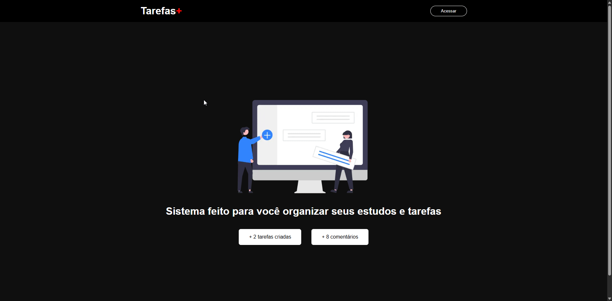

# 📋 Plataforma de Tarefas Colaborativas



Projeto desenvolvido **exclusivamente para fins de estudo**, com o objetivo de praticar conceitos modernos de **desenvolvimento web**, **autenticação**, **persistência de dados** e **interação entre usuários**.

A aplicação permite que usuários criem, removam e compartilhem tarefas simples (apenas uma string). Quando uma tarefa é marcada como pública, outros usuários podem interagir deixando comentários.

---

## 🚀 Tecnologias Utilizadas

* **Next.js** – Framework React com renderização híbrida (SSR/SSG)
* **Firebase**

  * Authentication (Login com Google Provider)
  * Firestore Database
* **Google Auth Provider** – Autenticação segura e rápida
* **TypeScript** *(opcional, caso esteja usando)*

---

## 🔐 Autenticação

O acesso à plataforma é feito através do **login com conta Google**, utilizando o Firebase Authentication.

* Apenas usuários autenticados podem:

  * Criar tarefas
  * Excluir suas próprias tarefas
  * Comentar em tarefas públicas

---

## 📝 Funcionalidades

### 👤 Usuário

* Login com Google
* Logout

### ✅ Tarefas

* Criar uma tarefa (texto simples)
* Excluir **apenas tarefas próprias**
* Marcar tarefa como **pública** ou **privada**

### 🌍 Tarefas Públicas

* Tarefas públicas ficam visíveis para todos os usuários
* Outros usuários podem:

  * Visualizar a tarefa
  * Comentar sobre ela

### 💬 Comentários

* Comentários associados a uma tarefa pública
* Apenas usuários autenticados podem comentar

---

## 🧠 Regras de Negócio

* Usuários **não podem excluir tarefas de outros usuários**
* Comentários só podem ser feitos em tarefas públicas
* Tarefas privadas são visíveis apenas para o criador

---

## 🗄️ Estrutura de Dados (Exemplo)

### Tarefa

* `id`
* `content` (string)
* `public` (boolean)
* `createdAt`
* `userId`
* `userName`

### Comentário

* `id`
* `taskId`
* `comment`
* `userId`
* `userName`
* `createdAt`

---

## 📚 Objetivos de Aprendizado

Este projeto foi criado para praticar:

* Autenticação com Firebase
* Providers de login (Google)
* Integração Next.js + Firebase
* Controle de permissões no Front-End
* Leitura e escrita no Firestore
* Conceitos de aplicações colaborativas

---

## ▶️ Como Executar o Projeto

1. Clone o repositório

2. Instale as dependências:

   ```bash
   npm install
   ```

3. Configure o Firebase:

   * Crie um projeto no Firebase
   * Ative Authentication com Google
   * Configure o Firestore
   * Adicione as variáveis de ambiente

4. Execute o projeto:

   ```bash
   npm run dev
   ```

---

## 📌 Observações

* Projeto **educacional**, não destinado a uso em produção
* Ideal para estudos de **Next.js**, **Firebase** e **autenticação social**

---

## 📄 Licença

Este projeto é livre para fins de estudo e aprendizado.

---

Desenvolvido com foco em aprendizado e evolução contínua 🚀
